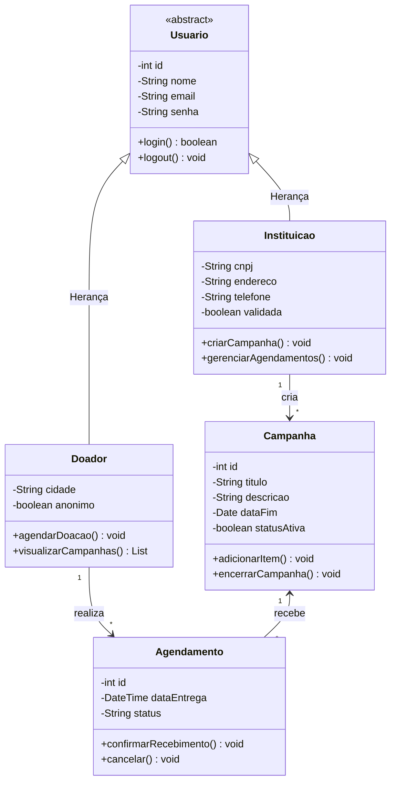

# Diagrama de Classes - DoaPerto Social

```mermaid
classDiagram
    class Usuario {
        <<abstract>>
        -int id
        -String nome
        -String email
        -String senha
        +login() boolean
        +logout() void
    }

    class Doador {
        -String cidade
        -boolean anonimo
        +agendarDoacao() void
        +visualizarCampanhas() List
    }

    class Instituicao {
        -String cnpj
        -String endereco
        -String telefone
        -boolean validada
        +criarCampanha() void
        +gerenciarAgendamentos() void
    }

    class Campanha {
        -int id
        -String titulo
        -String descricao
        -Date dataFim
        -boolean statusAtiva
        +adicionarItem() void
        +encerrarCampanha() void
    }

    class Agendamento {
        -int id
        -DateTime dataEntrega
        -String status
        +confirmarRecebimento() void
        +cancelar() void
    }

    Usuario <|-- Doador : Herança
    Usuario <|-- Instituicao : Herança
    Instituicao "1" --> "*" Campanha : cria
    Doador "1" --> "*" Agendamento : realiza
    Campanha "1" <-- "*" Agendamento : recebe
```
